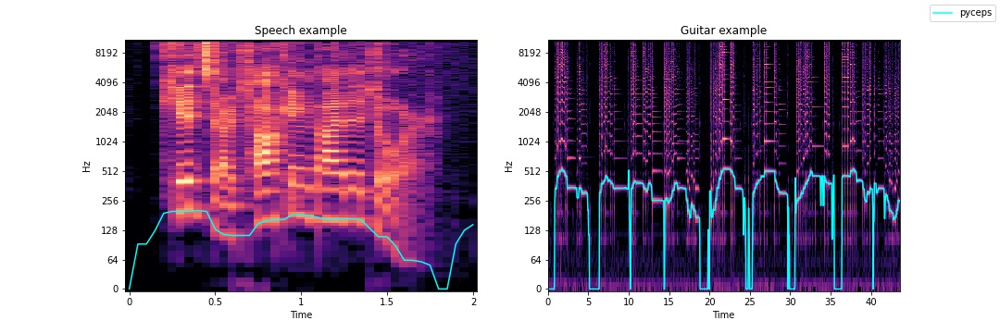
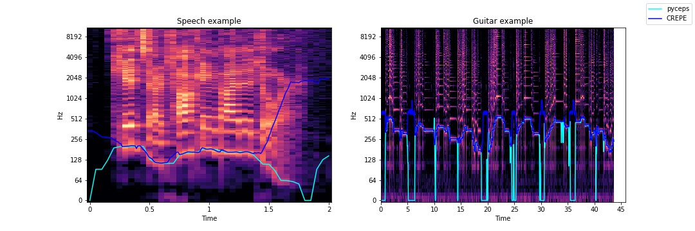
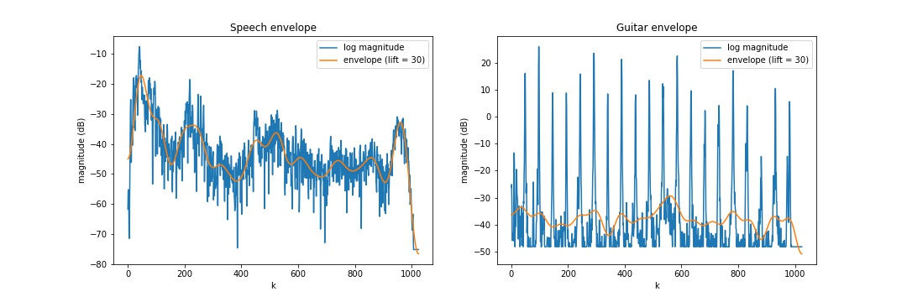

# PyCeps: Python Implementation for Cepstral Analysis

## Examples

## 1. F0 Estimation
</img>

### Comparison with "CREPE"
* CREPE pitch Tracker: https://github.com/marl/crepe

</img>

 

## 2. Spectral Envelope
### Cepstrally Smoothed Spectrogram
</img>
</img>